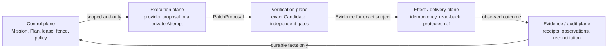

# Bullet Farm

**Many minds. One verified line to main.**

Bullet Farm is building the transaction boundary for coding agents: fenced authority, one repository writer, exact Candidates, independent Evidence, durable effect reconciliation, and protected integration.

**Current alpha:** the boundaries are component-proved; public installation, live providers, and the connected transaction remain blocked.

**Public index:** [github.com/neverhuman/bulletfarm](https://github.com/neverhuman/bulletfarm)

That is the public URL. The hyphenated slug `neverhuman/bullet-farm` is not. GitHub is a discovery and PR mirror, not source authority, and a clone is not an installer.

[Dated Stage-1 architecture preprint](docs/paper/bullet_farm_ieee.pdf) · [Dated Stage-1 executive brief](docs/paper/executive_brief.pdf) · [Architecture](docs/architecture.md) · [Current release truth](docs/assurance/release-truth.generated.md)

The preprints describe the earlier universal release envelope; the current staged release order is the [closure roadmap](docs/assurance/closure-roadmap.md). Paper regeneration remains blocked under [WP-01](docs/workplan.md).


[Static fallback](docs/readme-media/component-preview/fallback.png) · [Accessible transcript](docs/readme-media/component-preview/transcript.txt) · [Reproduction manifest](docs/readme-media/component-preview/manifest.json)

This is a pre-release engineering system, not an installer announcement. A model saying “done,” a process exiting zero, or a pull request opening has no completion authority.

## Public index

```bash
git clone https://github.com/neverhuman/bulletfarm.git bullet-farm
cd bullet-farm
```

Clone into `bullet-farm` so the checkout name matches the family member. This repository is the hub only. The kernel, BulletGit, and portal members are independent checkouts and are not published under hyphenated `neverhuman/bullet-*` slugs.

Public installation is not available. The checked-in `family.lock` is a diagnostic schema-2 snapshot; it cannot authorize source acquisition or a release install. The [source-setup runbook](docs/runbooks/source-setup.md) explains that boundary.

## Why Bullet is different

| Boundary | What Bullet requires |
| --- | --- |
| Fenced authority | Every Attempt carries a monotonically advancing fence. Superseded or expired authority is refused even if an old process is still alive. |
| One repository writer | Agents propose changes; BulletGit alone owns private clones and repository mutation. |
| Exact Candidate identity | A Candidate hashes its complete strict manifest: repository/change and base/head/tree/patch, producing Attempt and fence, scope and lineage, context/configuration/policy/routing snapshots, environment, and toolchain. Any changed manifest subject is a different Candidate; reusable content identity remains separate. |
| Independent Evidence | A verifier evaluates the exact Candidate without inheriting the writer's completion claim. |
| Ambiguous-effect read-back | A lost response becomes `UNKNOWN`. The broker reads the external system and adopts only the exact intended state; it never retries blindly. |
| Truthful uncertainty | `UNKNOWN` and `CONTRADICTORY` remain first-class outcomes. Missing state is never painted green. |

The intended transaction is:

```text
Mission → immutable Plan → fenced Attempt → exact Candidate
        → independent Evidence → brokered Effect → protected Integration
        → durable observation → surviving Outcome
```

## Preview an existing family

If all four ordinary sibling checkouts already exist as listed in `repos.manifest.toml`, run:

```bash
cd bullet-farm
just preview
```

`just preview` diagnoses tools, requires `doctor` to report `BLOCKED` with exit 3, runs the Hub component lane, and executes the bounded credential-free non-dispatch CLI demo. Its own success means the component preview behaved exactly as expected; it does not establish that the family is installable or releasable. The dated media below separately shows a synthetic component effect remaining `UNKNOWN`.

For supervised local UI development:

```bash
just dev
```

That command installs the locked Portal dependencies with lifecycle scripts disabled, starts `bullet-farmd` and Vite on loopback with a strict port, waits for both HTTP endpoints, and shuts down both process groups together. Open <http://127.0.0.1:5173>. Portal is a non-authoritative projection: it can display pending, verified, `UNKNOWN`, or contradictory state, but it cannot create authority.

## Provider boundary status

Offline suites validate bounded protocol transcripts. They do not execute a live model, read a provider home, or prove account/profile/version behavior.

| Provider | Current status | Contract boundary |
| --- | --- | --- |
| Claude | contract-tested / live blocked | Frozen stream-JSON request/event subset; live admission is disabled. |
| Codex | contract-tested / live blocked | Frozen [App Server](https://learn.chatgpt.com/docs/app-server) JSONL subset; the [Codex CLI](https://learn.chatgpt.com/docs/codex/cli) is not spawned by this proof. |
| Cursor | contract-tested / live blocked | Frozen ACP request/event subset; live admission is disabled. |
| Antigravity | contract-tested / live blocked | Frozen structured headless transcript subset; live admission is disabled. |


[Static fallback](docs/readme-media/provider-safety/fallback.png) · [Accessible transcript](docs/readme-media/provider-safety/transcript.txt) · [Reproduction manifest](docs/readme-media/provider-safety/manifest.json)

## Seven functions, five transaction authorities

Bullet Farm separates seven useful functions from five independently authorized
transaction domains: Control→Control; Cognitive execution, Repository execution,
and Session supervision→Execution; Independent verification→Verification;
Effect and delivery→Delivery/integration; and Evidence and audit→Evidence/audit.
The five-domain flow below is the authority path, not a claim that only five
functional planes exist.



The authority domains exchange typed, bounded subjects; they do not share a
model's informal notion of completion. Runner, BulletGit, broker, attestor,
integrator, observer, and auditor remain distinct principals inside their mapped
domains.

Concrete timeout example: the effect broker submits integration key `K` and loses the response. It records `UNKNOWN`, performs no second write, reads the protected ref and forge operation back, and adopts success only if the observed identity matches `K`, the expected old OID, and the intended Candidate. Missing or conflicting read-back stays `UNKNOWN` or becomes `CONTRADICTORY` for operator reconciliation.

## Where the code lives

Bullet remains four independent repositories. No physical consolidation or committed package/dependency sibling
path is required; `preview` and `dev` operate on the four existing sibling checkouts declared by the family manifest.

| Repository | Owns | Start here |
| --- | --- | --- |
| `bullet-farm` | onboarding, family/setup/release, policy, contracts, models, fixtures, public assurance | `README.md`, `src/`, `policy/`, `contracts/`, `formal/` |
| `bullet-kernel` | durable ledger, authority, provider boundaries, runner, verifier, effects, `bullet-farmd` | `crates/application/`, `crates/adapters/`, `crates/runner/`, `apps/` |
| `bullet-git` | sole writer, private clones, journal/CAS, Change and Candidate identity | `crates/bullet-git-*`, `crates/bullet-gitd/` |
| `bullet-portal` | generated API client and non-authoritative projections | `src/generated/`, `src/pages/`, `src/components/` |

The public GitHub index publishes this hub at [neverhuman/bulletfarm](https://github.com/neverhuman/bulletfarm). Local checkout names stay `bullet-farm`, `bullet-kernel`, `bullet-git`, and `bullet-portal`. See the [code map and “change X here” guide](docs/code-map.md) before editing a boundary.

## What exists, and what is still unproved

| Area | Implemented now | Not yet proved |
| --- | --- | --- |
| Authority | Lease/fence components and stale-attempt refusal | Connected Kernel-issued mutation authority across Runner and production BulletGit |
| Repository safety | BulletGit capability, journal, private-clone, and Candidate components | One connected transaction through protected integration |
| Verification | Exact-subject schemas and independent verifier components | Release-grade Evidence over the connected Candidate |
| Effects | Durable intent/outcome components and truthful `UNKNOWN` behavior | Credentialed Jeryu/GitHub write plus exact remote read-back receipt |
| Providers | Four offline protocol suites and policy-disabled zero-spawn refusal | Any sealed live-provider conformance receipt |
| Operator UI | farmd projections and Portal component/browser proofs | Authority-bearing commands or complete designed product surfaces |
| Distribution | Signed bundle verification/extraction components | Authenticated schema-3 sources, package production, activation, and two clean installs |

The exhaustive inventories are [product gaps](docs/assurance/product-gaps.md), the active [closure roadmap](docs/assurance/closure-roadmap.md), and generated [release truth](docs/assurance/release-truth.generated.md). `TRANSACTION_PROOF` is absent, so transaction-ready and production-ready remain false.

## Pinned public comparison

This table compares documented contracts, not benchmark results or product quality. The three external subjects are pinned to [Gas Town v1.2.1](https://github.com/gastownhall/gastown/releases/tag/v1.2.1), [DeepSeek Harness dsh-v0.1.1-rc.2](https://github.com/deepseek-ai/DeepSeek-Harness/releases/tag/dsh-v0.1.1-rc.2), and [Omnigent v0.10.0](https://github.com/omnigent-ai/omnigent/releases/tag/v0.10.0); their immutable per-dimension sources and adjudication notes live in the [dated comparison snapshot](docs/assurance/competitor-snapshot.md#pinned-dimension-notes). The Bullet row summarizes this local checkout's component evidence and explicit unproved boundary; it is not a pinned external benchmark result.

| Pinned subject | Writer identity | Incarnation fence | Exact verification subject | Effect read-back | Protected integration | Truthful uncertainty |
| --- | --- | --- | --- | --- | --- | --- |
| Bullet Farm current alpha | Partial/configuration-dependent | Partial/configuration-dependent | Partial/configuration-dependent | Partial/configuration-dependent | Partial/configuration-dependent | Documented |
| Gas Town v1.2.1 | Partial/configuration-dependent | Not documented | Partial/configuration-dependent | Partial/configuration-dependent | Partial/configuration-dependent | Partial/configuration-dependent |
| DeepSeek Harness dsh-v0.1.1-rc.2 | Not documented | Not documented | Not documented | N/A | N/A | Partial/configuration-dependent |
| Omnigent v0.10.0 | Partial/configuration-dependent | Partial/configuration-dependent | Not documented | Partial/configuration-dependent | Partial/configuration-dependent | Partial/configuration-dependent |

Vocabulary is deliberately narrow: `Documented`, `Partial/configuration-dependent`, `Not documented`, `Unknown`, and `N/A`. `Not documented` is not a claim that a mechanism cannot exist; `Unknown` is reserved for a pinned source that cannot be adjudicated. No matched receipt-bearing benchmark exists, so Bullet makes no superiority claim.

## What we will not claim

- 100% autonomy or zero regressions.
- Exactly-once physical effects across an unreliable network.
- That provider state, terminal state, a portal color, or HTTP success is canonical truth.
- That a GitHub App token enforces Bullet fences.
- Public installation, live-provider execution, a connected transaction, or production readiness before their required signed receipts exist.

## Contributing and proof

Start with the [code map](docs/code-map.md), [test and evidence strategy](docs/testing.md), [architecture](docs/architecture.md), and [coordination runbook](docs/runbooks/fleet.md). Local and hosted lanes call the same forge-neutral scripts:

```bash
just fast
just lint
just contract
just security
just docs
just check                 # the five lanes, sequentially, exactly once
just check-family          # dependency-ordered four-repository component proof
just readme-record         # real credential-free scenarios
just readme-render         # pinned VHS image, network disabled
just readme-check          # claims, media, hashes, limits, double render
```

The public index is [github.com/neverhuman/bulletfarm](https://github.com/neverhuman/bulletfarm). GitHub is a secretless PR/discovery mirror. The Hub defines `CI / required` in `.github/workflows/ci.yml`; this first public snapshot does not enable hosted Actions. It is not authoritative release Evidence, and no badge is published before a hosted run and branch-protection read-back exist. Future Jeryu jobs are described by `ci.toml` but remain inactive pending forge ratification and immutable provisioning.

Documentation: [index](docs/README.md) · [paper sources](docs/paper/README.md) · [workplan](docs/workplan.md) · [CI policy](docs/testing.md) · [license](LICENSE)

Apache-2.0.
