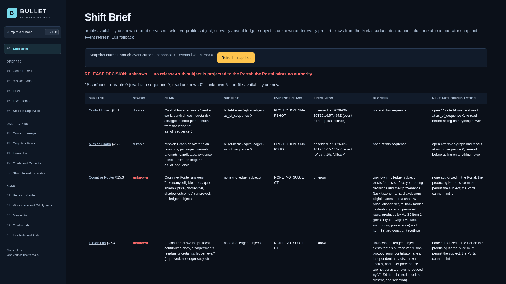
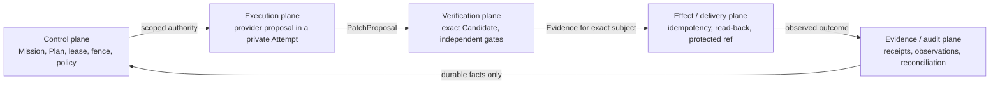

# Bullet Farm

**Many minds. One verified line to main.**

Bullet Farm is building the transaction boundary for coding agents: fenced authority, one repository writer, exact Candidates, independent Evidence, durable effect reconciliation, and protected integration.

**Current alpha:** the boundaries are component-proved; public installation, live providers, and the connected transaction remain blocked.

Public installation is not available. The checked-in [family.lock](family.lock) is still schema 2, which the installer refuses. See the [source setup runbook](docs/runbooks/source-setup.md) for the admitted bootstrap requirements.

**Primary integration repository:** [github.com/neverhuman/bulletfarm](https://github.com/neverhuman/bulletfarm)

The publication tool assembles the four supporting member trees and preserves their exact source identities in the aggregate. `neverhuman/bullet-farm` is the supporting Hub repository. A source clone does not establish installation or release acceptance.

[Dated Stage-1 architecture preprint](docs/paper/bullet_farm_ieee.pdf) · [Dated Stage-1 executive brief](docs/paper/executive_brief.pdf) · [Architecture](docs/architecture.md) · [Current release truth](docs/assurance/release-truth.generated.md)

The preprints describe the earlier universal release envelope; the current staged release order is the [closure roadmap](docs/assurance/closure-roadmap.md). Paper regeneration remains blocked under [WP-01](docs/workplan.md).


[Static fallback](docs/readme-media/component-preview/fallback.png) · [Accessible transcript](docs/readme-media/component-preview/transcript.txt) · [Reproduction manifest](docs/readme-media/component-preview/manifest.json)

This is a pre-release engineering system, not an installer announcement. A model saying “done,” a process exiting zero, or a pull request opening has no completion authority.

## Source checkout and unsigned local console

The current Linux source build provides an authenticated CLI/TUI and a local
Portal. `bullet` and `bulletfarm` open the same TUI by default. Durable Head
conversation, supervised provider terminals and an installed daily-coding
service remain incomplete. Operating HOLD remains; the instructions below
start an unsigned contributor console and do not enroll a provider account.

### Prerequisites and exact build

| Tool | Required source pin or prerequisite |
| --- | --- |
| Rust for Kernel and its CLI | 1.97.1, selected by `bullet-kernel/rust-toolchain.toml` |
| Rust for Hub checks | 1.95.0, selected by `bullet-farm/rust-toolchain.toml` |
| Node / npm | 22.23.2 / 10.9.8; the console checks both |
| Just | Support for `[positional-arguments]`; 1.51.0 supports these recipes |
| Linux tools | Bash, Git, curl, jq, GNU coreutils, sed/grep and util-linux (`setsid`, `flock`) |

Install the selected tools first and make them available on `PATH`. Use one
Bash session for the following commands; quoted paths also support spaces.
From a new aggregate checkout:

```bash
git clone https://github.com/neverhuman/bulletfarm.git bulletfarm
cd bulletfarm
BULLET_SOURCE_ROOT="$PWD"
BULLET_BUILD_ROOT="$HOME/.cache/bullet-source-build"
git rev-parse HEAD

(cd "$BULLET_SOURCE_ROOT/bullet-kernel" && \
  CARGO_TARGET_DIR="$BULLET_BUILD_ROOT" cargo build --locked \
    -p bullet --bin bullet --bin bulletfarm \
    -p bullet-farmd --bin bullet-farmd)

BULLET_CLI="$BULLET_BUILD_ROOT/debug/bullet"
BULLET_DAEMON="$BULLET_BUILD_ROOT/debug/bullet-farmd"
"$BULLET_CLI" --help
sha256sum "$BULLET_CLI" "$BULLET_BUILD_ROOT/debug/bulletfarm" "$BULLET_DAEMON"
```

Keep the source commit and binary hashes with diagnostics. These are local
build identities, not signed release evidence. The executable is at the path
above; this build does not add `bullet` to your `PATH`. The sibling `bulletfarm`
binary has the same command parser, state and exit behavior.

The aggregate has one Git checkout. Its four member directories are source
trees; canonical family proof and publication use independent member checkouts.
`just preview` is for that canonical layout. `just setup` requires an admitted
external `bullet-family` and explicit Cargo/Node/npm subjects, then currently
refuses the checked-in schema-2 lock with `UNSUPPORTED_SCHEMA`. It does not
install a signed service. See [source setup](docs/runbooks/source-setup.md).

### Start a fresh local instance

Choose short, private directories directly under your home, outside the clone
and `/tmp`. The server's lease socket path must remain shorter than 100 bytes.
These examples intentionally refuse if either state directory already exists:

```bash
umask 077
BULLET_SERVER_STATE="$HOME/.bullet-source-console"
BULLET_CLIENT_STATE="$HOME/.bullet-source-client"
mkdir -m 700 -- "$BULLET_SERVER_STATE" "$BULLET_CLIENT_STATE" &&

(cd "$BULLET_SOURCE_ROOT/bullet-farm" && \
  just -- console --data-dir "$BULLET_SERVER_STATE" \
    --bullet "$BULLET_CLI" --farmd "$BULLET_DAEMON" \
    --bind 127.0.0.1:7420 --portal-origin http://127.0.0.1:5173)
```

Put Just's `--` before `console`. Explicit binary paths prevent an inherited
Cargo target override from selecting the wrong build. The launcher initializes
private server state, runs the Portal preinstall scan, installs locked npm
dependencies with lifecycle scripts disabled, and starts farmd plus Vite.
It checks its own Vite startup and the proxied `/health` response before printing
`farmd=`, `origin=`, `portal=`, `bootstrap_file=` and log paths. Health means the
HTTP service is responding; it does not establish task or provider readiness.

The launcher returns with farmd and Vite running. It does not install a service,
qualify reboot recovery or provide a later supervised stop. Both console
`--stop` and the underlying dogfood stop helper currently refuse. A saved PID
file cannot authorize signaling. Read the lifecycle section before restarting.

### Authenticate and open the CLI

For the CLI, consume the new instance's token through stdin, never a command-line
argument. Keep the endpoint and Origin exactly as configured above:

```bash
"$BULLET_CLI" auth login --state-dir "$BULLET_CLIENT_STATE" \
  --farmd http://127.0.0.1:7420 --origin http://127.0.0.1:5173 \
  --stdin < "$BULLET_SERVER_STATE/custody/bootstrap.token"
"$BULLET_CLI" auth status --state-dir "$BULLET_CLIENT_STATE"
"$BULLET_CLI" tui --state-dir "$BULLET_CLIENT_STATE"
```

A successful `auth status` reports the authenticated operator, exact session and
expiry. Pass the same `--state-dir` on subsequent commands. Without that flag,
credentials default to `$XDG_STATE_HOME/bullet/operator`, or
`$HOME/.local/state/bullet/operator` when `XDG_STATE_HOME` is absent; plain
`bullet` and `bulletfarm` use that default location. A second login does not
silently replace existing credentials or resolve a pending credential record.

For the browser, open <http://127.0.0.1:5173>, enter an **unused** token in
**Operator session → One-time bootstrap token**, and select **Authenticate
local session**. **Check session** validates a browser session already created.
CLI login does not create a browser cookie, and its consumed token cannot be
reused. Choose which client consumes the new token; using both against one
instance requires separately provisioned valid sessions. The contributor
launcher does not yet document that additional-session provisioning flow.
Never copy the CLI cookie/CSRF store into the browser as a workaround.

### Use xbabe2 through SSH

Build, start and run the CLI on xbabe2 under the owning user, in an ordinary SSH
terminal. In a separate terminal on your local computer, forward the Portal
port; replace `YOUR_SSH_USER` with that account's SSH login:

```bash
ssh -N -L 127.0.0.1:5173:127.0.0.1:5173 YOUR_SSH_USER@xbabe2
```

Open the same `http://127.0.0.1:5173` URL locally. Browser API requests use Vite's
same-origin farmd proxy; do not expose farmd or Vite on a public bind address.
For an alternate instance, use unused server ports such as `7421` and `5174`,
set `--bind 127.0.0.1:7421 --portal-origin http://127.0.0.1:5174`, and use that
exact Origin in login and both `5174` positions in the SSH forward. Keep each
instance's server/client state separate. Closing the forward disconnects the
browser, but is not a daemon shutdown or a native-session lifecycle proof.

### Current commands and TUI controls

These commands observe the authenticated instance without submitting work:

```bash
"$BULLET_CLI" tui --state-dir "$BULLET_CLIENT_STATE" --once
"$BULLET_CLI" mission list --state-dir "$BULLET_CLIENT_STATE" --json
"$BULLET_CLI" coding list --state-dir "$BULLET_CLIENT_STATE" --limit 20 --json
"$BULLET_CLI" coding board --state-dir "$BULLET_CLIENT_STATE" --json
```

`--once` prints a plain TUI snapshot; it is not JSON. `coding list` pages are
bounded to 100 rows and accept `--after`. Use exact IDs returned by discovery
for `coding status <command-id>`, `coding task <command-id>` or
`tui --subject <subject-id>`, with the same client state directory. Diagnostics
go to stderr; use `--json` on commands that expose it for machine-readable data.
Piping text into the default CLI does not submit a goal to Head.

| Key in the current TUI | Action |
| --- | --- |
| Ctrl+K | Open command palette |
| Tab / Shift+Tab | Switch list/detail focus |
| Up / Down or k / j | Move selection |
| Enter / Escape | Open / go back |
| `?` / uppercase `J` | Help / raw JSON view |
| `r` | Request refresh when no read is already pending |
| Ctrl+C | Detach from Bullet's TUI; preserve server work |

The TUI first renders before credential discovery and refreshes periodically.
On detach it prints a reconnect command preserving the selected subject and
state directory. Copy that command exactly. This is Bullet's ordinary TUI;
provider-native input, controller takeover and `Ctrl+]` then `d` detachment
remain part of the unqualified native-terminal work.

`coding submit`, `retry`, `status`, `task`, `board` and `watch` exist; consult the
specific subcommand's `--help` for inputs. Submission persistence and its
command ID do not establish Head progress, a launched provider, a Candidate,
verification or integration. A lost acknowledgement requires reconciliation of
the original command in the same state directory; do not mint another command
or delete its journal to make an ambiguous result disappear. `coding stop`
currently reports `STOP_UNIMPLEMENTED`. Generic signed-in provider execution
still refuses unsupported containment; account credentials do not remove it.

### State, lifecycle and troubleshooting

Keep server and client directories private and preserve their contents:

| Location | Purpose |
| --- | --- |
| Server `ledger.sqlite` and companion files | Durable local ledger; preserve as one database state |
| Server `custody/` | Lease transport, local peer registry and bootstrap material; secret-bearing |
| Server `socket/`, PID files and `logs/` | Local socket, diagnostic process records and startup/runtime logs |
| Client state directory | Credentials and exact command journals; secret-bearing recovery state |

Do not delete PID files to bypass `OPERATOR_CONSOLE_PID_STATE_UNRECONCILED`,
use PID numbers as authority to kill processes, or copy a live SQLite file as a
qualified backup. Preserve the state and launch evidence for operator
reconciliation. A fresh directory creates a different instance; it is not a
restart, restore, upgrade or recovery of the old one. Installed lifecycle and
backup/restore qualification remain open.

| Symptom | Next check |
| --- | --- |
| Tool or build refusal | Check the pinned versions, selected member directory and explicit binary paths; retain stderr |
| No ready Portal or occupied port | Inspect the printed startup logs and port settings; never treat an unrelated listener as readiness |
| Unsafe state/ancestor refusal | Inspect ownership, permissions and symlinks for the selected path; do not broaden permissions or recursively change unrelated homes |
| Authentication missing or expired | Run `auth status` with the original client directory; preserve pending records and use a valid session |
| Browser unauthorized after CLI login | The browser needs its own bootstrap exchange; **Check session** does not log in |
| Empty views, `UNKNOWN` or blocked work | Retain the exact subject/reason and source version; empty or saved records are not completed execution |

`auth revoke --state-dir ...` requests server-side revocation and then clears
local credentials after acknowledgement. `auth forget --state-dir ...` only
forgets local credentials; it does not revoke server authority. Neither is a
work-cancellation command. Keep unresolved response-loss evidence and journals.
Before sharing diagnostics, review logs, environment and state for secrets;
never upload bootstrap tokens, cookies, CSRF material or whole credential stores.
See the [loopback runbook](docs/runbooks/loopback-console.md) and
[security guidance](SECURITY.md).

### Path to daily coding

`bullet chat`, `setup`, `serve`, `agent`, `sessions` and `attach` are planned
entry points and are not present in this CLI. The next usable coding milestone
requires durable Head/task admission, contained provider custody, Candidate
preservation, useful independent gates and approved integration on an installed
service. The [xbabe2 work order](docs/assurance/xbabe2-development-closeout.md)
separates the first admitted three-provider task from the twelve-task campaign,
four-provider showcase, seven-day observation and complete product acceptance.
Until those predicates pass, the console is useful for development and
inspection, not a claim that real daily coding or the requested GIFs are ready.

## Why Bullet is different

| Boundary | What Bullet requires |
| --- | --- |
| Fenced authority | Every Attempt carries a monotonically advancing fence. Superseded or expired authority is refused even if an old process is still alive. |
| One repository writer | Agents propose changes; BulletGit alone owns private clones and repository mutation. |
| Exact Candidate identity | A Candidate hashes its complete strict manifest: repository/change and base/head/tree/patch, producing Attempt and fence, scope and lineage, context/configuration/policy/routing snapshots, environment, and toolchain. Any changed manifest subject is a different Candidate; reusable content identity remains separate. |
| Independent Evidence | A verifier evaluates the exact Candidate without inheriting the writer's completion claim. |
| Ambiguous-effect read-back | A lost response becomes `UNKNOWN`. The broker reads the external system and adopts only the exact intended state; it never retries blindly. |
| Truthful uncertainty | `UNKNOWN` and `CONTRADICTORY` remain first-class outcomes. Missing state is never painted green. |

The intended transaction is:

```text
Mission → immutable Plan → fenced Attempt → exact Candidate
        → independent Evidence → brokered Effect → protected Integration
        → durable observation → surviving Outcome
```

## Preview an existing family

If all four ordinary sibling checkouts already exist as listed in `repos.manifest.toml`, run:

```bash
cd bullet-farm
just preview
```

`just preview` diagnoses tools, requires `doctor` to report `BLOCKED` with exit 3, runs the Hub component lane, and executes the bounded credential-free non-dispatch CLI demo. Its own success means the component preview behaved exactly as expected; it does not establish that the family is installable or releasable. The dated media below separately shows a synthetic component effect remaining `UNKNOWN`.

For supervised local UI development:

```bash
just dev
```

That command installs the locked Portal dependencies with lifecycle scripts disabled, starts `bullet-farmd` and Vite on loopback with a strict port, waits for both HTTP endpoints, and shuts down both process groups together. Open <http://127.0.0.1:5173>. **`just dev` does not provision a bootstrap token and cannot create an operator session.** Use `just console` for login. Portal is a non-authoritative projection: it can display pending, verified, `UNKNOWN`, or contradictory state, but it cannot create authority.

## Provider boundary status

Offline suites validate bounded protocol transcripts. They do not execute a live model, read a provider home, or prove account/profile/version behavior.

| Provider | Current status | Contract boundary |
| --- | --- | --- |
| Claude | contract-tested / live blocked | Frozen stream-JSON request/event subset; live admission is disabled. |
| Codex | contract-tested / live blocked | Frozen [App Server](https://learn.chatgpt.com/docs/app-server) JSONL subset; the [Codex CLI](https://learn.chatgpt.com/docs/codex/cli) is not spawned by this proof. |
| Cursor | contract-tested / live blocked | Frozen ACP request/event subset; live admission is disabled. |
| Antigravity | contract-tested / live blocked | Frozen structured headless transcript subset; live admission is disabled. |


[Static fallback](docs/readme-media/provider-safety/fallback.png) · [Accessible transcript](docs/readme-media/provider-safety/transcript.txt) · [Reproduction manifest](docs/readme-media/provider-safety/manifest.json)

## Retained xbabe2 console diagnostics

These captures document local UI diagnostics from different times and source
versions. Both manifests declare provider `none`, a null Candidate, and
`release_eligible: false`. They do not demonstrate a synchronized provider task.
Operating HOLD remains.




The [captions and manifests](media/operator-console/README.md) disclose the
source versions, timing and geometry limits. Their generated command, Attempt
and receipt labels are diagnostic labels, not Kernel-issued transaction proof.
The existing [xbabe2 work order](docs/assurance/xbabe2-development-closeout.md#real-1080p-capture-as-maintained-source)
requires installed operation, real authenticated provider tasks, continuous
native-resolution recordings of the same campaign, independent verification,
approved integration and matched excerpts before publication acceptance.

The earlier [contained Claude Candidate recording](media/dogfood/README.md)
remains historical component evidence with a cleanup refusal; it does not
establish that installed workflow. The VHS tapes above are a separate component
set with their own `just readme-check` lane. No current media-checker result
establishes the full recording requirements.

## Private capture and rendering

The [capture runbook](docs/demo-gif/README.md) describes native CLI observations
and the Portal screenshot sequence. Each run preserves its own private inputs,
failed attempts and outcome records. These tools are under local qualification;
no current recording proves production account admission or a completed Bullet
coding transaction.

Portal rendering preserves the original PNGs and creates a pixel-exact FFV1
master. GIF output is checked against the decoded source pixels and labeled
`EXACT` or `QUANTIZED`. Terminal casts are retained byte-for-byte; their GIFs are
rendered derivatives with no claim of original RGB equality. Rendering and
checking require explicit local inputs and tool hashes.

The [deep audit](docs/assurance/deep-audit-20260909.md) and
[health checkpoint](docs/assurance/health-checkpoint-20260909.md) identify the
remaining production, CI and account qualification work. Historical local media
is retained for review and is not presented as an accepted production demo.

## Seven functions, five transaction authorities

Bullet Farm separates seven useful functions from five independently authorized
transaction domains: Control→Control; Cognitive execution, Repository execution,
and Session supervision→Execution; Independent verification→Verification;
Effect and delivery→Delivery/integration; and Evidence and audit→Evidence/audit.
The five-domain flow below is the authority path, not a claim that only five
functional planes exist.



The authority domains exchange typed, bounded subjects; they do not share a
model's informal notion of completion. Runner, BulletGit, broker, attestor,
integrator, observer, and auditor remain distinct principals inside their mapped
domains.

Concrete timeout example: the effect broker submits integration key `K` and loses the response. It records `UNKNOWN`, performs no second write, reads the protected ref and forge operation back, and adopts success only if the observed identity matches `K`, the expected old OID, and the intended Candidate. Missing or conflicting read-back stays `UNKNOWN` or becomes `CONTRADICTORY` for operator reconciliation.

## Where the code lives

Bullet remains four independent repositories. No physical consolidation or committed package/dependency sibling
path is required; `preview` and `dev` operate on the four existing sibling checkouts declared by the family manifest.

| Repository | Owns | Start here |
| --- | --- | --- |
| `bullet-farm` | onboarding, family/setup/release, policy, contracts, models, fixtures, public assurance | `README.md`, `src/`, `policy/`, `contracts/`, `formal/` |
| `bullet-kernel` | durable ledger, authority, provider boundaries, runner, verifier, effects, `bullet-farmd` | `crates/application/`, `crates/adapters/`, `crates/runner/`, `apps/` |
| `bullet-git` | sole writer, private clones, journal/CAS, Change and Candidate identity | `crates/bullet-git-*`, `crates/bullet-gitd/` |
| `bullet-portal` | generated API client and non-authoritative projections | `src/generated/`, `src/pages/`, `src/components/` |

The publication tool targets all four member trees at [neverhuman/bulletfarm](https://github.com/neverhuman/bulletfarm). Local checkout names stay `bullet-farm`, `bullet-kernel`, `bullet-git`, and `bullet-portal`. See the [code map and “change X here” guide](docs/code-map.md) before editing a boundary.

## What exists, and what is still unproved

| Area | Implemented now | Not yet proved |
| --- | --- | --- |
| Authority | Lease/fence components and stale-attempt refusal | Connected Kernel-issued mutation authority across Runner and production BulletGit |
| Repository safety | BulletGit capability, journal, private-clone, and Candidate components | One connected transaction through protected integration |
| Verification | Exact-subject schemas and independent verifier components | Release-grade Evidence over the connected Candidate |
| Effects | Durable intent/outcome components and truthful `UNKNOWN` behavior | Credentialed Jeryu/GitHub write plus exact remote read-back receipt |
| Providers | Four offline protocol suites and policy-disabled zero-spawn refusal | Any sealed live-provider conformance receipt |
| Operator UI | farmd projections and Portal component/browser proofs | Authority-bearing commands or complete designed product surfaces |
| Distribution | Signed bundle verification/extraction components | Authenticated schema-3 sources, package production, activation, and two clean installs |

The exhaustive inventories are [product gaps](docs/assurance/product-gaps.md), the active [closure roadmap](docs/assurance/closure-roadmap.md), and generated [release truth](docs/assurance/release-truth.generated.md). The offline local bridge is component evidence only; `TRANSACTION_PROOF`, transaction-ready, and production-ready remain false.

## Pinned public comparison

This table compares documented contracts, not benchmark results or product quality. The four external subjects are pinned to [Gas Town v1.2.1](https://github.com/gastownhall/gastown/releases/tag/v1.2.1), its [Gas City v1.4.1 successor](https://github.com/gastownhall/gascity/releases/tag/v1.4.1), [DeepSeek Harness dsh-v0.1.1-rc.2](https://github.com/deepseek-ai/DeepSeek-Harness/releases/tag/dsh-v0.1.1-rc.2), and [Omnigent v0.10.0](https://github.com/omnigent-ai/omnigent/releases/tag/v0.10.0); their immutable per-dimension sources and adjudication notes live in the [dated comparison snapshot](docs/assurance/competitor-snapshot.md#pinned-dimension-notes). The Bullet row summarizes this local checkout's component evidence and explicit unproved boundary; it is not a pinned external benchmark result.

| Pinned subject | Writer identity | Incarnation fence | Exact verification subject | Effect read-back | Protected integration | Truthful uncertainty |
| --- | --- | --- | --- | --- | --- | --- |
| Bullet Farm current alpha | Partial/configuration-dependent | Partial/configuration-dependent | Partial/configuration-dependent | Partial/configuration-dependent | Partial/configuration-dependent | Documented |
| Gas Town v1.2.1 | Partial/configuration-dependent | Not documented | Partial/configuration-dependent | Partial/configuration-dependent | Partial/configuration-dependent | Partial/configuration-dependent |
| Gas City v1.4.1 | Partial/configuration-dependent | Not documented | Not documented | Not documented | Partial/configuration-dependent | Not documented |
| DeepSeek Harness dsh-v0.1.1-rc.2 | Not documented | Not documented | Not documented | N/A | N/A | Partial/configuration-dependent |
| Omnigent v0.10.0 | Partial/configuration-dependent | Partial/configuration-dependent | Not documented | Partial/configuration-dependent | Partial/configuration-dependent | Partial/configuration-dependent |

Vocabulary is deliberately narrow: `Documented`, `Partial/configuration-dependent`, `Not documented`, `Unknown`, and `N/A`. `Not documented` is not a claim that a mechanism cannot exist; `Unknown` is reserved for a pinned source that cannot be adjudicated. No matched receipt-bearing benchmark exists, so Bullet makes no superiority claim.

## What we will not claim

- 100% autonomy or zero regressions.
- Exactly-once physical effects across an unreliable network.
- That provider state, terminal state, a portal color, or HTTP success is canonical truth.
- That a GitHub App token enforces Bullet fences.
- Public installation, live-provider execution, a connected transaction, or production readiness before their required signed receipts exist.

## Contributing and proof

Deliver reviewed changes through a pull request to
[neverhuman/bulletfarm](https://github.com/neverhuman/bulletfarm), preserving
canonical member source identities and the reviewed aggregate generation flow.
Root edits belong in this Hub's `publication/root/` templates. The public
contributor path through member review and aggregate publication is still
incomplete; direct edits to generated output do not qualify regeneration.

Start with the [code map](docs/code-map.md), [test and evidence strategy](docs/testing.md), [architecture](docs/architecture.md), and [coordination runbook](docs/runbooks/fleet.md). Local and hosted lanes call the same forge-neutral scripts:

```bash
just fast
just lint
just contract
just security
just docs
just check                 # the five lanes, sequentially, exactly once
just check-family          # dependency-ordered four-repository component proof
just readme-record         # real credential-free scenarios
just readme-render         # pinned VHS image, network disabled
just readme-check          # claims, media, hashes, limits, double render
```

The primary delivery target is [github.com/neverhuman/bulletfarm](https://github.com/neverhuman/bulletfarm), assembled from the four supporting source repositories. Hosted Actions and protected integration are not yet active on that aggregate. The Hub defines local and hosted lane sources, but a definition is not a successful run; no CI badge is published before exact-subject execution and branch-protection read-back. New requests select GitHub through the committed publication configuration; the [publication runbook](docs/runbooks/publication.md) describes preparation and required execution evidence under the [delivery plan](docs/assurance/full-product-dogfood-plan.md). Retained publication requests keep their original identities; JeRyu self-hosting remains a separate release obligation. Scheduled Jankurai is machine-local; hosted required is the merge gate.

Documentation: [index](docs/README.md) · [paper sources](docs/paper/README.md) · [workplan](docs/workplan.md) · [CI policy](docs/testing.md) · [license](LICENSE)

Apache-2.0.
